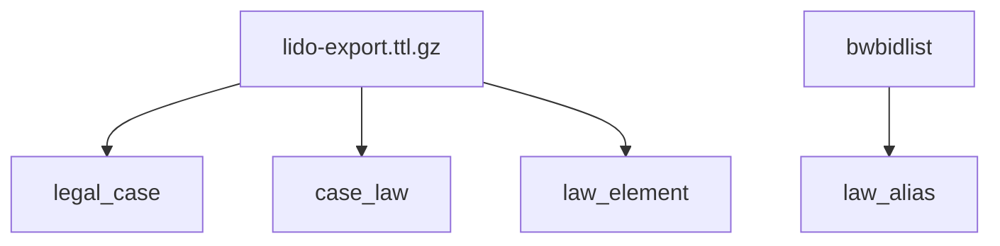
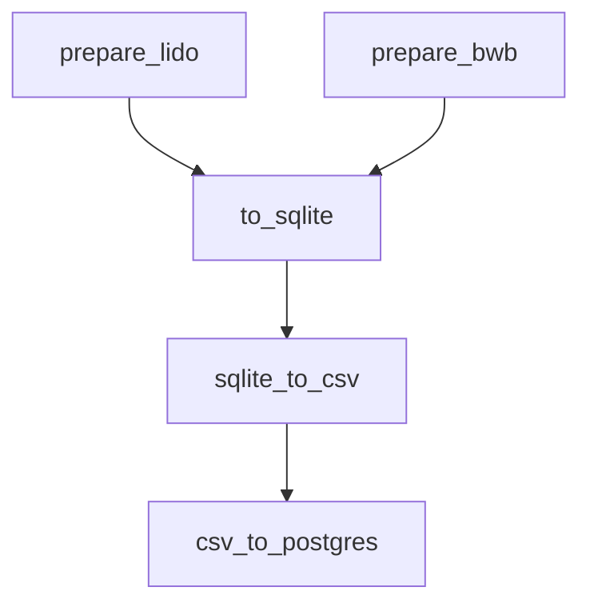

# Lido Extraction

The DAG inside of this folder is for the purpose of facilitating performing article search from the case-law-explorer app.

## Data

Input:
- **lido-export.ttl.gz**
  - source: https://data.overheid.nl/dataset/linked-data-overheid
  - file: https://linkeddata.overheid.nl/export/lido-export.ttl.gz
  - frequency: monthly (first day of the month)
  - license: [CC-0 (1.0)](http://creativecommons.org/publicdomain/zero/1.0/deed.nl)
- **bwbidlist**
  - source: https://gitlab.com/koop/ld/lx/linkextractor/src/webapp/lists/bwb/sitemap.xmap
  - file: https://zoekservice.overheid.nl/BWBIdService/BWBIdList.xml.zip

Output:
- postgres database, with tables:
  - **legal_case**,
  - **law_element**,
  - **case_law**,
  - **law_alias**




## DAG

The DAG contains components that may appear obscure and overly complex at a first glance. However, many of the choices were made deliberately for some specific function. In this section, we will lay out the rationale for the components of the DAG, and give insight on why more straight-forward approaches were not chosen.

The overal main components of the DAG are as follows:

1. [`prepare_lido`](#prepare_lido)
2. [`prepare_bwb`](#prepare_bwb)
3. [`to_sqlite`](#to_sqlite)
4. [`sqlite_to_csv`](#sqlite_to_csv)
5. [`csv_to_postgres`](#csv_to_postgres)

The components are ran in the same order as in the list, where `prepare_lido` and `prepare_bwb` can be ran simultaneously.



## Connections

This DAG assumes the presence of the postgres connection with the name `pg_lido` as the destionation of the pipeline.

### `prepare_lido`

#### Purpose
We're using the `lido-export.ttl.gz` file as a source of truth of lido instead of quering the remote lido server, since this gives more flexibility and control on the type of data we're trying to extract. We are not loading

#### Flow

First it downloads `lido-export.ttl.gz`. Then, using [serdi](https://drobilla.gitlab.io/serd/man/serdi.html) it transforms the turtle file into ntriples.  The ntriples are then piped to a grep that matches a subject at the start of the line for either cases and laws, and consecutively grep for specific predicates that describe data were looking for. Finally, the file is sorted by the subject columns using the piped command `sort -k1,1`. Since triples files contain a triple of subject, predicate and objects on each line, this will ensure that all predicates and their respective objects will be grouped together in the resulting file, making it easy for further processing of subjects.

```
download_lido_ttl >> make_laws_nt >> make_cases_nt
```

##### Laws

For extracting law-information, we first grep the turtle file on everything that starts with:
```xml
<http://linkeddata.overheid.nl/terms/bwb/id/
```

Subsequently, it will match any of the following fixed strings, which are considered predicates:
```xml
<http://purl.org/dc/terms/identifier>
<http://purl.org/dc/terms/type>
<http://www.w3.org/1999/02/22-rdf-syntax-ns#type>
<http://linkeddata.overheid.nl/terms/isOnderdeelVan>
<http://linkeddata.overheid.nl/terms/isOnderdeelVanRegeling>
<http://purl.org/dc/terms/title>
<http://www.w3.org/2004/02/skos/core#prefLabel>
<http://www.w3.org/2000/01/rdf-schema#label>
<http://linkeddata.overheid.nl/terms/heeftJuriconnect>
<http://linkeddata.overheid.nl/terms/heeftOnderdeelNummer>
```

The resulting data will be put in a file called `lido-laws.nt`

##### Laws

For extracting case-information, we first grep the turtle file on everything that starts with:
```xml
<http://linkeddata.overheid.nl/terms/jurisprudentie/id/
```

Subsequently, it will match any of the following fixed strings, which are considered predicates:
```xml
<http://purl.org/dc/terms/identifier>
<http://purl.org/dc/terms/type>
<http://www.w3.org/1999/02/22-rdf-syntax-ns#type>
<http://purl.org/dc/terms/title>
<http://www.w3.org/2004/02/skos/core#prefLabel>
<http://www.w3.org/2000/01/rdf-schema#label>
<http://linkeddata.overheid.nl/terms/refereertAan>
<http://linkeddata.overheid.nl/terms/linkt>
<http://linkeddata.overheid.nl/terms/heeftZaaknummer>
<http://linkeddata.overheid.nl/terms/heeftUitspraakdatum>
```

The resulting data will be put in a file called `lido-cases.nt`

### `prepare_bwb`

#### Purpose

The purpose of the `prepare_bwb` component is rather straight-forward. The information is extracted from https://zoekservice.overheid.nl/BWBIdService/BWBIdList.xml.zip. The data will be used to construct aliases for specific law-elements, such as _BW_ for _Burgerlijk Wetboek_. The alias will be connected to a BWB-id. This logic was inspired from https://gitlab.com/koop/ld/lx/linkextractor/src/webapp/lists/bwb/sitemap.xmap, where the file is used to construct a trie. This trie is used by linkeddata.overheid.nl for matching input strings to law elements.

#### Flow

First, the `BWBIdList.xml.zip` file is downloaded and extracted. Then, the file `prepare_bwbidlist.py` processed the xml file and converts the relevant fields to json in the function `task_bwbidlist_xml_to_json`.

For each `RegelingInfo` element in the `RegelingInfoLijst` list, we're extracting the `BWBId` and `OfficieleTitel` and every:
- `Citeertitel`,
- `Afkorting`,
- `NietOfficieleTitel`

The result is stored in the file `bwb/BWBIdList.json` with the (typescript) type: `[bwbId, alias[]][]`, i.e. a tuple of bwb-id's alongside the list of aliases. Example:

```json
[
  [
    "BWBR0001821",
    [
      "Wet van 2/1 april 1810, Bulletin des Lois 285",
      "Loi concernant les Mines, les Minières et les Carrières"
    ]
  ],
  [
    "BWBR0001822",
    [
      "Besluit van 12 december 1813",
      "Besluit afschaffing binnenlandse paspoorten en verdere reglementaire bepalingen ten aanzien van binnen- en buitenlandse paspoorten"
    ]
  ],
  ...
]
```

### `to_sqlite`

#### Purpose

Before inserting the formatted data into the postgres database, it is first inserted into local sqlite database. The reason for this is that it is much faster to write to a local file database instead of inserting to a remote database, where the overhead of opening and closing a connection for each insert or N inserts can become significant.

#### Flow

The files `lido-laws.nt` and `lido-cases.nt` are processed in by `laws_to_sqlite.py` and `cases_to_sqlite.py` respectively, in which the triples are parsed in blocks of the same subject.
The file `BWBIdList.json` is processed in `bwbidlist_to_sqlite.py`.

##### `lido-laws.nt`
Each block of triples where the predicate [type](http://www.w3.org/1999/02/22-rdf-syntax-ns#type) is either of the following:
```
http://linkeddata.overheid.nl/terms/Wet -> wet
http://linkeddata.overheid.nl/terms/Deel -> deel
http://linkeddata.overheid.nl/terms/Boek -> boek
http://linkeddata.overheid.nl/terms/Titeldeel -> titeldeel
http://linkeddata.overheid.nl/terms/Hoofdstuk -> hoofdstuk
http://linkeddata.overheid.nl/terms/Artikel -> artikel
http://linkeddata.overheid.nl/terms/Paragraaf -> paragraaf
http://linkeddata.overheid.nl/terms/SubParagraaf -> subparagraaf
http://linkeddata.overheid.nl/terms/Afdeling -> afdeling
```

For each block, the following columns are mapped from their respective predicates:

- `lido_id`:
  - `subject[43:]`
- `bwb_id`:
  - `lido_id.split("/")[0]`
- `title`
  - `<http://purl.org/dc/terms/title>` if exists, else
  - `<http://www.w3.org/2004/02/skos/core#prefLabel>` if exists, else
  - `<http://www.w3.org/2000/01/rdf-schema#label>`
- `type`
  - the mapped value of the type-predicate as above
- `jc_id`
  - the first object of `<http://linkeddata.overheid.nl/terms/heeftJuriconnect>` where the id starts with `jci1.3`
- `number`
  - object of `<http://linkeddata.overheid.nl/terms/heeftOnderdeelNummer>`


##### `lido-cases.nt`
We'll use this case as an example: `ECLI:NL:GHDHA:2024:1109`
For each case processed, the following columns are mapped from the respective predicates:

- `ecli_id`
  - `subject.split(/)[-1]`
- `title`
  - `<http://purl.org/dc/terms/title>` if exists, else
  - `<http://www.w3.org/2000/01/rdf-schema#label>` if exists, else
  - `<http://www.w3.org/2004/02/skos/core#prefLabel>`
- `zaaknummer`
  - `<http://linkeddata.overheid.nl/terms/heeftZaaknummer>`
- `uitspraakdatum`
  - `<http://linkeddata.overheid.nl/terms/heeftUitspraakdatum>`

Additionally, the links from cases to laws is processed from this file. The data comes from two predicates:
**`linkt`**
- links to other cases or laws. the contens are simply uri's to the corresponding resource

**`refereertAan`**
- contains the links from this case to other cases or laws. holds:
  - the way it is written (opschrift)
  - the lido-url of the referenced item
  - the jci-uri of the referenced item
- structured as a query string items, joined by pipe-charcters
- example:
  - raw: `linktype=http://linkeddata.overheid.nl/terms/linktype/id/lx-referentie|target=bwb|uri=jci1.3:c:BWBR0005288&boek=5&titeldeel=1&artikel=1&z=2024-01-01&g=2024-01-01|lido-id=http://linkeddata.overheid.nl/terms/bwb/id/BWBR0005288/1723924/1992-01-01/1992-01-01|opschrift=artikel 5:1 BW`
  - split by `|`:
    - `linktype=http://linkeddata.overheid.nl/terms/linktype/id/lx-referentie`
    - `target=bwb`
    - `uri=jci1.3:c:BWBR0005288&boek=5&titeldeel=1&artikel=1&z=2024-01-01&g=2024-01-01`
    - `lido-id=http://linkeddata.overheid.nl/terms/bwb/id/BWBR0005288/1723924/1992-01-01/1992-01-01`
    - `opschrift=artikel 5:1 BW`

##### `BWBIdList.json`
As mentioned before, the type of `BWBIdList.json` is `[bwbId, alias[]][]`. Every combination of a bwbId with a unique row is inserted into the database as a row.

### `sqlite_to_csv`

#### Purpose

The purpose of the sqlite-to-csv export is to transfer the data from the fast-accessible local SQLite database to the remotely hosted Postgres database. CSV is used as an intermediate step becasue of the fast transfers it allows.

#### Flow / Implementation

The below bash-commands are executed sequentally, creating `export-cases.csv`, `export-laws.csv`, `export_caselaw.csv` and `export_lawalias.csv` in the process.

```sh
sqlite3 stage.db -header -csv "SELECT * FROM legal_case;" > export-cases.csv
sqlite3 stage.db -header -csv "SELECT * FROM law_element;" > export-laws.csv
sqlite3 stage.db -header -csv "SELECT * FROM case_law;" > export_caselaw.csv
sqlite3 stage.db -header -csv "SELECT * FROM law_alias;" > export_lawalias.csv
```

### `csv_to_postgres`

#### Purpose

Quickly importing the exported data from the tables of the local SQLite database into the postgres database.

#### Flow

All mentioned functions are defined in `swap_postgres.py`.

1. Create `{table}_staging` for each table without any indexes and constraints,
2. Load data from `csv` into each `{table}_staging`,
3. Rename `{table}` to `{table}_prev`
4. Rename `{table}_staging` to `{table}`
5. Drop contraints and indexes from `{table}_prev` (to prevent naming collisions)
6. Add constraints and indexes to the new prod table `{table}`

- Step 1 is done in `task_create_staging_tables()` with `SQL_CREATE_STAGING_TABLES`
- Step 2 is done in `task_load_csv()`
- Steps 3-6 are done in `task_swap()` in a transaction with `SQL_SWAP_TABLES_AND_DEPS`
