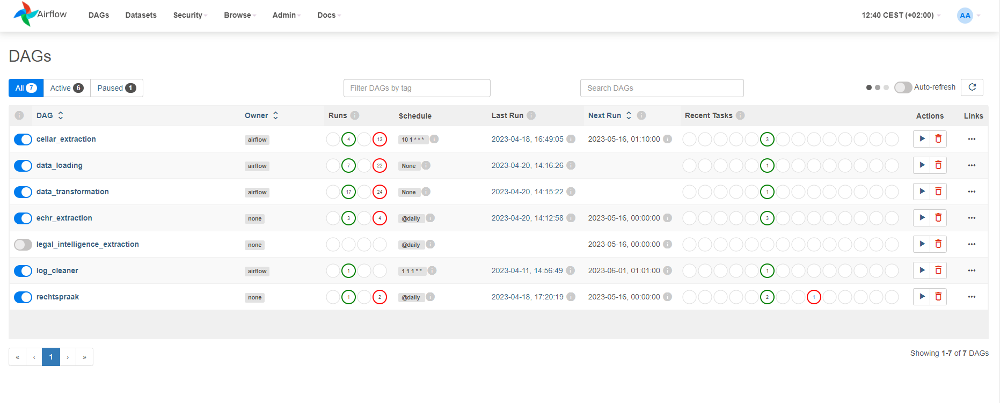

# Airflow Deployment
This section will talk about setting up your ETL pipeline on airflow. In a few simple steps, you can have your pipeline up and running.


## Setup

**Clone the [maastrichtlawtech/case-law-explorer](https://github.com/maastrichtlawtech/case-law-explorer) project.**

```bash
$ git clone https://github.com/maastrichtlawtech/case-law-explorer
```

**Setup the airflow user - > only for web deployment**

In case you will launch the airflow on the web, you need to create an admin user to protect the access to your pipeline. 
You need to edit the `docker-compose.yaml` file, which should be in the root folder of the project. You will need to edit the following lines in the file ( line 240) :
```
 environment:
      <<: *airflow-common-env
      _AIRFLOW_DB_UPGRADE: 'true'
      _AIRFLOW_WWW_USER_CREATE: 'true'
      _AIRFLOW_WWW_USER_USERNAME: ${_AIRFLOW_WWW_USER_USERNAME:-airflow}   <- CHANGE THIS
      _AIRFLOW_WWW_USER_PASSWORD: ${_AIRFLOW_WWW_USER_PASSWORD:-airflow}   <- CHANGE THIS
      _PIP_ADDITIONAL_REQUIREMENTS: ''
    user: "0:0"
    volumes:
      - .:/sources
```

**Setup the .env file**

Follow the same procedure, as described in the [data extraction section]() ###TODO ADD LINK HERE###


### Deployment

1. Build the airflow image that runs the automated ETL pipeline. Make sure you are in the root folder of the project.
    ```bash
   WINDOWS:
   
    docker-compose up
   
   LINUX:
   
    sudo docker-compose up
   
    ```
2. **LINUX only :** The project might crash here, with permission errors. In case this happens, you need to give full permissions to allow users to edit and create new files/folders in the airflow folder. One of the solutions is available [here](https://stackoverflow.com/questions/59412917/errno-13-permission-denied-when-airflow-tries-to-write-to-logs).
3. Your Airflow deployment should now be up and running, available locally at `http://127.0.0.1:8080`.

If the image was built successfuly, after logging-in this is what airflow should look like : 


DAGs are the tasks, which airflow executes periodically. They can be found in `airflow/dags`. In this setup, they execute the methods mentioned in the [Data extraction section]() ## TO DO ADD LINK HERE IDK HOW YET ##. A detailed explanation of how DAGs work can be found [here](https://airflow.apache.org/docs/apache-airflow/stable/core-concepts/dags.html).
### In case you are restarting the deployment...

Extraction tasks store the `last-update date` as Variables in the airflow database. This database will **NOT** be wiped whenever you re-built the airflow image.
In case you want to re-deploy and re-built the database and download all of the metadata again, you will need to wipe the airflow database to clear the dates.
More information on how to achieve that can be found [here](https://stackoverflow.com/questions/59556501/apache-airflow-initdb-vs-resetdb).

